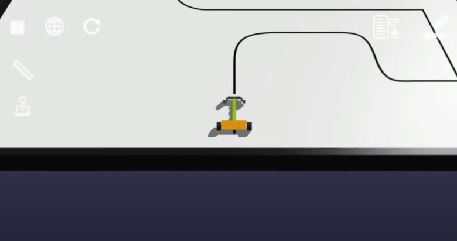

# GearsBot-LineFollower-8-sensors
Implementation of a line follower robot with 8 optical sensors.

### ./robots: several different designs
Description of file names: 
* 8sens: 8 sensors
* MK: author of the project
* mas5k: robot mass (body) 5000
* MaleKola4: wheel diameter 4cm

### ./maps
Contains map json files of varying difficulty levels.

### ./python
Contains py files of the robot control algorithms.
* 8sensKola5czas49.py : Best for easy map. 
* gearsPython.py : Default algorithm that is worth modifying. Contains comments that describe the code for the purpose of understanding it.

### 
!nazwa alternatywna
[Film](https://youtu.be/sbSGgd5mUig?si=rP5f5NeyQFozdSCt).

